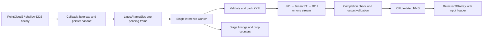

# pp_infer implementation architecture and recovery plan

Prepared 2026-10-01. Target confirmed by the user: **Ubuntu 24.04 / ROS 2 Jazzy on an NVIDIA GPU**.

Implementation update: the user authorized implementation on 2026-10-01. W02 CPU core/build boundaries and W03 local ROS adapters/configuration are implemented; see `recovery/PROGRESS.md` for checks and limitations. The remaining runtime/worker/deployment design below is pending. Baseline file/line evidence remains historical.

## Decision and scope

Keep one ROS package and one process. Use a short subscription callback, one replaceable pending frame, one inference worker, one TensorRT execution context, and one persistent CUDA stream. Separate CPU correctness from GPU integration so useful development continues without a working driver. Optimize only after representative measurements establish the bottleneck.

This deliverable designs the modernization in `PROJECT_REVIEW_AND_UPDATE_PLAN.md` and supplies a working development checkpoint mechanism. The quoted prompt in that document is reference material, not a new instruction to execute its installation commands. The C++ inference code, CMake, ROS package and launch behavior have not been modernized by this planning task.

Start here after an interruption: [recovery/RESUME.md](recovery/RESUME.md). Track work in [recovery/tasks.json](recovery/tasks.json) and [recovery/PROGRESS.md](recovery/PROGRESS.md). All proposed runtime files, flags and launch arguments below are future work unless explicitly described as available now.

## Verified starting point

Source baseline: Git commit `2301135`. The original review document was already untracked when work began; preserve it. File/line references below refer to this baseline.

| Observation | Evidence and consequence |
|---|---|
| Build settings conflict and paths are fixed | `CMakeLists.txt:27–53,73–100`: C++14 plus forced C++11, legacy CUDA discovery, fixed include/library paths. Replace with target-based configuration. |
| Jazzy build blockers | `src/pp_inference_node.cpp:46,76,199–200`: missing local header, untyped class parameter and old hypothesis fields. Installed Jazzy headers contain `hypothesis.class_id` and `hypothesis.score`. |
| Unbounded age under overload | `src/pp_inference_node.cpp:97–100,118–227`: history depth 700 and synchronous inference in the callback. |
| Unsafe input allocation | `src/pp_inference_node.cpp:135–161`: capacity follows received cloud size, with 32-bit byte arithmetic. Engine capacity and actual tensor dtype are unchecked. |
| Unsafe output decoding | `src/pointpillar.cpp:296,330–354`: four assumed bindings, assumed nine-float rows, ignored enqueue result and unchecked output count. |
| Ownership and profiler bugs | `src/pp_inference_node.cpp:95,115`: raw allocation without cleanup. `src/pointpillar.cpp:239`: unmanaged runtime. `:260–263`: persistent context receives a stack-local profiler pointer. |
| Incorrect stream/timing design | Runtime uses default stream at node lines 94–95; callbacks create another at 123–127. Per-frame allocations and device-wide synchronization add cost. |
| Geometry and suppression risks | `src/postprocess.cpp:160–161,195,201–211`: zero-count division, unchecked negative top-k and class-agnostic suppression. |
| Startup can unexpectedly build an engine | `src/pointpillar.cpp:152–215`: missing engine enters model-building code and writes a different cache path. Separate engine preparation from deployment. |

Read-only machine checks during this task found x86_64 Ubuntu 24.04.4, `/opt/ros/jazzy`, colcon, Python 3.12.3, CMake 3.28.3 and CUDA compiler 12.0.140. `nvidia-smi` exited 9 because it could not communicate with the driver. No `NvInfer.h` was found under `/usr/include`; this does not rule out another installation. No `.engine`, `.plan`, `.etlt` or `.onnx` exists in this checkout. A CUDA compiler is not evidence of usable GPU inference. No C++ build or GPU benchmark was performed.

## 1. Small, explicit component boundaries

Use three production CMake targets, with test executables added as needed:

| Target | Owned work | Dependency rule |
|---|---|---|
| `pp_core` | Plain box/tensor metadata types, checked capacity arithmetic, pure validation, rotated geometry and NMS | C++17 standard library; no ROS, PCL, CUDA or TensorRT headers |
| `pp_runtime` | Engine inspection, logger/runtime/engine/context lifetimes, persistent buffers/stream, validated inference result | `pp_core`, selected TensorRT and CUDA runtime |
| `pp_infer` | ROS parameters, input layout validation and PCL conversion, worker/mailbox, message mapping, diagnostics | `pp_runtime`, ROS messages, PCL/conversions; `Threads::Threads` where needed |

Do not create a generic backend framework for one model. Inject one narrow fake-inference callable in worker tests; do not build multiple production backends. Keep `postprocess.cpp` and its header where practical. Replace CUDA `float2` in CPU geometry with a local `Point2` structure. Extract runtime responsibilities from `pointpillar.cpp` incrementally; avoid moving all files and changing behavior in the same patch.

Proposed additional files: `include/pp_infer/model_contract.hpp`, `include/pp_infer/latest_frame_slot.hpp`, `include/pp_infer/cuda_resources.hpp`, `src/pointcloud_adapter.cpp`, `config/pp_infer.yaml`, and focused `tests/`. Use normal `add_library`/`add_executable`, explicit source lists, proper project include directories, `cxx_std_17`, `find_package(CUDAToolkit)` and imported TensorRT library targets. Compile CUDA language only if actual `.cu` files are introduced. Keep ONNX parsing/build tools outside the deployed runtime target. Declare ROS dependencies consistently; remove unused message_filters includes and decide whether tf2 is retained before declaring it.

The implemented `PP_BUILD_RUNTIME=OFF` and `PP_BUILD_ROS_ADAPTER=OFF` configuration builds the CPU core/tests without TensorRT, CUDA or ROS discovery. `PP_BUILD_ROS_ADAPTER=ON` builds local Jazzy/PCL input/config/output tests with no inference runtime. See README for runnable commands. The adapter is an additional testable library boundary inside the ROS layer.

## 2. Freeze the model contract before selecting the NVIDIA stack

The OS/ROS decision is fixed; exact GPU, driver, CUDA, TensorRT, TAO export and plugin versions are still open. Do not pick the newest TensorRT automatically. The old README's TensorRT 8.2 / OSS 22.02 recipe is historical evidence, not a compatibility guarantee for this target.

In W01, produce `config/environment.lock.json` and `config/model_contract.json` with:

- GPU model, compute capability, driver, architecture, OS, ROS and compiler versions; exact CUDA/TensorRT packages and plugin source revision/build flags.
- Model/export version, SHA-256 of model and engine, build command, build machine/GPU and plugin library hashes. Store proprietary artifacts outside Git and record their controlled location. Do not store TAO keys.
- Every I/O tensor's name, input/output role, dtype, host/device location, format, rank, shape and profile bounds; batch size and selected profile.
- Maximum point capacity `P`, feature order, point count encoding, required padding, class index order, intensity normalization, training range, coordinate units/axes, yaw convention and center-versus-bottom Z semantics.
- Output names, candidate capacity `B`, row/schema layout, count encoding, score interpretation, whether the engine already filters/NMSes, and intended class-aware or class-agnostic NMS.
- A representative input fixture, reference output/evaluator, dataset identity and agreed numerical/accuracy tolerance.

Read metadata from the real engine and compare it with the manifest; a manifest cannot make an incompatible engine safe. Initially support one verified batch-one, linear-layout contract and reject others with an actionable error. Resolve all dynamic dimensions/profile choices before allocating. Reject unsupported data-dependent output shapes until a bounded allocator is explicitly implemented. Check shape products using overflow-safe `size_t` arithmetic. Precision in an engine filename does not establish input/output dtypes.

**Compatibility gate:** use a standalone pinned-stack smoke harness or offline tool to validate official support information for the candidate stack, build/register the required plugins, deserialize the engine, run a known fixture and compare outputs. This gate must not depend on the unfinished W04/W05 runtime. Retain logs and artifact hashes. If legacy plugins cannot build/run with a Jazzy-compatible stack, treat plugin/export migration as a separate prerequisite. A container does not repair a missing host driver or make an old engine compatible.

For a selected TensorRT 10.x path, use named I/O addresses and `enqueueV3`; migrate ownership and plugin APIs with that selection. Do not scatter version-conditionals across the node. Support one pinned stack initially; only add a second adapter for a demonstrated deployment need. NVIDIA documents default version-specific engine compatibility and the named-tensor migration; neither establishes compatibility for this particular TAO export. [Engine compatibility](https://docs.nvidia.com/deeplearning/tensorrt/latest/inference-library/engine-compatibility.html), [C++ migration](https://docs.nvidia.com/deeplearning/tensorrt/latest/api/migration/tensorrt-8x-to-10x-c-api-patterns.html), [plugin APIs](https://docs.nvidia.com/deeplearning/tensorrt/latest/inference-library/plugins-api-migration.html).

Engine generation is an explicit offline operation with temporary output, validation and atomic promotion. Runtime startup loads only the configured engine and fails clearly if missing/incompatible. Preserve the prior verified engine and manifest together for rollback.

## 3. Bounded live execution and ownership

Suggested starting QoS: input `KeepLast(1)`, best effort, volatile; output shallow configurable history. Confirm compatibility with the actual LiDAR publisher and consumers. Best effort is commonly appropriate for recent sensor readings; a reliable subscriber cannot consume from a best-effort publisher. Reliable transport can also introduce backpressure outside the application slot. [Official ROS QoS source](https://github.com/ros2/ros2_documentation/blob/jazzy/source/Concepts/Intermediate/About-Quality-of-Service-Settings.rst).

The callback performs only cheap envelope checks (including maximum message bytes), records a monotonic receive time and local sequence, exchanges a `ConstSharedPtr` into the slot under a mutex, increments `replaced_pending` when necessary, and signals a condition variable. Release the displaced pointer outside the lock. The worker waits on `stop || pending`, takes the pointer, releases the lock, then performs all conversion and inference. Never hold the slot lock during GPU or publication work. Latest means newest received; source timestamp ordering is a separate optional policy because rosbag clocks may jump.

At most **one active + one pending** frame is retained by this application handoff; a callback can transiently hold another pointer. DDS, transport and an upstream driver have separate buffers. A maximum message byte limit and shallow QoS prevent the application from retaining arbitrarily large pending clouds; serialization can allocate before the callback, so test DDS resource limits on deployment.

The worker selects the CUDA device and creates, uses and tears down the runtime on that thread. Startup signals success/failure before enabling the subscription. Logger and plugin handles outlive runtime/engine/context. Context and an optional persistent profiler are destroyed before the engine and runtime; buffers/events/stream remain alive through completion. Destructors do not throw or abort. For C++17, use `std::thread`, mutex, condition variable and an explicit join; do not depend on C++20 `jthread`.

Shutdown: stop accepting frames, set stop/discard pending under lock, notify worker, finish/drain its outstanding GPU work, destroy its resources, join, then release publisher/node. Maintain publisher lifetime until join. A CUDA call can stall despite a one-slot queue; a bounded shutdown/restart policy requires a process supervisor on target hardware. Never destroy buffers while device work can still use them.

For normal frame failures, drop that frame and increment a reasoned counter. For a failed CUDA context or serious runtime error, enter fault state and stop accepting inference work; preserve diagnostics and exit for a supervisor restart. Avoid blind per-frame retries and stale output publication.

## 4. Memory, synchronization and correctness invariants

Allocate one reusable workspace from validated maximum capacities. For linear four-feature FP32 input, an illustrative staging allocation is `P * 4 * sizeof(float)`; compute from actual tensor format/dtype in production. A nine-FP32-field output would be `B * 9 * sizeof(float)` only if that layout is confirmed. Total memory also includes both message pointers, PCL scratch, host and device I/O, NMS scratch, TensorRT engine/context/workspace and plugin allocations. Record measured GPU/host peaks; the I/O formula is not the whole memory budget.

For a confirmed discrete GPU, start with persistent device I/O and capped pinned host staging; compare against reused managed memory on real hardware if worthwhile. The actual GPU is still unknown. Keep PCL first. Reserve reusable point/candidate/output vectors, while acknowledging PCL and ROS serialization can still allocate. Remove per-frame CUDA allocations and stream creation; do not claim completely allocation-free execution.

Single-stream ordering:

1. Validate PointCloud2 `data`, `width`, `height`, `row_step`, `point_step`, fields, datatypes, offsets, counts and byte order with checked arithmetic. Respect organized-cloud row padding; reject unsupported layouts before PCL conversion. Require X/Y/Z/intensity or a documented model-compatible fallback.
2. Remove/reject nonfinite points as specified by the contract, apply only recorded normalization and range handling, set the actual valid point count. Empty valid input produces an explicitly empty result without launching TensorRT if the model does not accept zero points. An invalid message produces a diagnostic/drop, not a successful empty detection.
3. If valid points exceed capacity, reject by default. Add deterministic sampling only after specifying its method/seed and passing accuracy evaluation. Never silently truncate or overflow. Initialize unused tensor storage/padding as required each frame; stale prior points must not influence results.
4. Enqueue H2D copies, input count/reset operations, inference, then D2H copies on the same persistent stream, respecting each tensor's host/device location. Initially copy the bounded full output and count together for one completion wait; optimize count-first transfers only if measured worthwhile.
5. Check enqueue, copy and event/synchronization results. Wait for completion before CPU access or buffer reuse. Use stream events rather than device-wide synchronization on the successful frame path.
6. Validate `0 <= count <= B` before indexing. Invalid count is a rejected inference result, not a silently clamped success. Validate finite score/geometry, positive dimensions and an integral, in-range class value **before** converting it to an integer. Clear result state on every attempt; never decode outputs after a failed enqueue.
7. Run deterministic rotated NMS. Handle no intersection/degenerate polygons without division by zero; bound temporary polygon storage and candidate counts. Reject invalid NMS thresholds/top-k and NaN sort inputs. Specify stable tie ordering and verify same-class/cross-class behavior against the model reference.
8. Publish Jazzy `hypothesis.class_id/score`, box geometry and the original timestamp/frame ID in the array and each detection. Preserve current numeric-string class IDs unless a documented consumer contract chooses labels. Populate hypothesis pose consistently where used; verify axes, yaw and Z convention with known boxes. If coordinates are transformed, update the frame and use the appropriate timestamped transform.

Latency controls are separate from validity. Configure an optional maximum monotonic residence time and, only with comparable clocks, source frame age. Check before inference and before publication. Count expired work separately; clock mismatch or a negative age must not silently pass as a valid latency measurement. A latest-frame slot bounds queue growth, not worst-case GPU time or hard real-time latency.

## 5. Implementation sequence and release gates

Each row is a milestone. Split it into patches containing one behavior and its relevant check; prefer sessions of roughly 30–60 minutes, but checkpoint after every coherent edit and test regardless of time. These are work-sizing suggestions, not delivery estimates. Only one agent edits a shared file at a time.

| ID | Work and file scope | Dependencies | Gate before completion |
|---|---|---|---|
| W00 | Architecture, task ledger, recovery helper/runbook | None | Recovery tests pass; source snapshot/status work; no inference changes |
| W01 | Platform/model inventory, `environment.lock.json`, `model_contract.json`, known fixture | None | Working GPU; selected runtime/plugins deserialize and infer correctly; unknown requirements resolved |
| W02 | CMake/package cleanup; CPU-only core; geometry/NMS safety and tests | W00 | CPU-only configure/build/test without NVIDIA stack; sanitizer checks of malformed geometry; dependency consistency |
| W03 | Typed ROS config, safe PointCloud2 adapter, Jazzy output mapping, fake-runtime tests | W02 | Malformed/empty/oversize/layout fixtures; class/pose/header mapping; positive scale and parameter bounds |
| W04 | Runtime RAII, contract inspection and named bindings for the selected stack | W01, W02 | Exact target build; missing/wrong engine/plugin/dtype/shape failures; clean startup/shutdown |
| W05 | Reusable buffers, one stream, checked inference and output decode | W03, W04 | Known-fixture parity; capacity boundaries; injected enqueue failure never publishes stale output; GPU memory check |
| W06 | Latest-frame worker, counters, startup/fault/shutdown lifecycle | W03, W05 | Slow fake inference replaces pending frames; one runtime owner; shutdown races; target overload test |
| W07 | Launch arguments, installed YAML, stage metrics, diagnostics | W06 | Installed launch starts; overrides actually reach node; QoS/header/clock checks; bounded logging |
| W08 | Representative replay, sustained profiling and justified optimization | W01, W07 | Agreed tail latency/drop/memory/accuracy criteria; 30-minute target run and overload run with recorded artifacts |
| W09 | Reproducible setup/run/troubleshooting/deployment guide and CI | W08 | Clean-machine rehearsal on pinned stack; documented rollback; CI distinguishes CPU, ROS and GPU evidence |

Critical path: W01 → W04 → W05 → W06 → W07 → W08 → W09, with W02/W03 feeding it. Start W02 while W01 is externally blocked. W03 uses explicit fixture contracts until W01 supplies actual capacity, normalization, coordinates and class semantics; W05 must revalidate their integration against the real model contract. Geometry tests and a standalone mailbox stress harness can be developed independently; integrating the mailbox still requires W05. Draft documentation/CI early, but do not mark W09 complete before end-to-end validation. No CPU test result substitutes for a GPU gate.

Stop a milestone if its prerequisite is missing; record a specific unblock action and continue independent work. Do not repeatedly reinstall libraries or rerun the same failing GPU probe without an environment change. Keep verified steps as reviewable Git commits when implementation is underway; keep unfinished state in checkpoints. Recover by inspecting diffs, not resetting the checkout.

## 6. Measurement and acceptance

Set numerical targets with the owner before W08: GPU model/VRAM, LiDAR rate and worst cloud size/bytes, allowed end-to-end frame age and miss rate, minimum useful output rate, permitted drop fraction, memory budget and accuracy metric/tolerance on a named dataset. Missing values remain `null` in the task ledger; invented numbers are not acceptance criteria.

Record CPU monotonic times for receive → worker start → preprocessing → postprocessing → publish return. Use reusable CUDA events on the inference stream for H2D, inference and D2H; report warm-up separately. Report callback-to-publication residence time separately from sensor timestamp-to-publication age. Publication return measures local submission, not remote consumer receipt; add a subscriber measurement if the downstream deadline requires it. For rosbag replay, use simulation time consistently for source age and monotonic time for processing durations, and handle pauses/backward jumps.

Retain p50/p95/p99 and sample counts for stages, residence and comparable source age; incoming, started, published and failed rates; replaced/stale/invalid/oversize/fault drop counts; RSS/GPU memory; temperature and throttling. Do not sum individual stage p99 values and call that end-to-end p99. Measure DDS/transport losses separately when the publisher can provide counts; the application cannot infer all lost frames from callbacks alone.

Tests must cover disjoint/identical/rotated/touching/degenerate boxes, equal scores, cross-class overlap, zero/maximum/oversize clouds, row padding and invalid fields, nonfinite values, negative/oversized counts, repeated empty/failing frames after a valid frame, QoS incompatibility, shutdown during work and producer rates above sustainable inference rate. CPU CI runs core tests and sanitizers; ROS CI uses fake inference; a provisioned GPU runner performs plugin, engine and accuracy tests. Mark missing GPU resources as skipped/blocked, never passed.

Run representative bags at nominal and overload rates and a sustained 30-minute target run after warm-up. Accept bounded pending storage and memory without sustained growth, explicit frame drops, required percentiles/deadline-miss rate and reference accuracy. Use a fixed observation window/sample count for percentile comparisons. Extra reliability, sampling, FP16/INT8 changes, top-k reduction, direct PointCloud2 decoding and GPU NMS each need their own before/after measurement and accuracy gate. A slow NMS profile may justify score filtering/partial selection first; do not add streams or contexts simply to increase average FPS.

## 7. Configuration and operational handoff

W07 will add launch arguments for config file, engine/manifest paths, input/output topics and `use_sim_time`; YAML will contain QoS, validated NMS settings, diagnostics and age limits. Model-critical classes/normalization/capacity come from the checked manifest and cannot drift silently through independent parameters. Initially make model/device/QoS and processing parameters read-only after startup and require restart for changes; do not accept updates that diverge from allocated buffers or worker configuration. Log effective configuration and hashes at startup. Replace the misleading runtime `data_type` knob with engine metadata; expose build precision only in offline generation.

W09's runbook must provide the exact verified environment and installation method, workspace layout, dependency installation, export/engine preparation, build, launch, live input, bag replay, output checking, visualization, diagnostics and rollback. Record working versions only after W01. Do not copy the old README's command that overwrites a system plugin library. Use a scoped installation/container and validate loaded library paths.

The CPU/ROS test CMake options above are implemented. New launch arguments remain pending; current launch has a hard-coded engine path and no custom arguments. After implementing the new interface, verify its help/arguments and installed configuration before publishing commands. Deployment must use a restart policy with backoff and a restart ceiling; preserve fault logs and the prior verified engine/config/code combination.

## 8. Recovery when credit or context runs out

The durable state is on disk, not in the model's conversation. The available-now `tools/recovery.py` uses Python and Git locally and makes no model calls. It saves source/config snapshots, staged/unstaged patches, file hashes, Git identity and a task/next-action record; see its runbook for exclusions and limits. It never restores over the working tree automatically.

Checkpoint before a milestone, after each coherent edit, after a test gate and before long-running work. Write exact test commands/results and next action in `recovery/PROGRESS.md` before checkpointing. If credit stops abruptly, the last complete checkpoint is the baseline; later on-disk edits are unfinished work to inspect and revalidate. A partial checkpoint is not a successful checkpoint. No mechanism can save unsent model reasoning or guarantee an uncheckpointed edit is complete.

Resume the existing chat when usage is available, or start a fresh chat with `recovery/RESUME.md` and this repository. The CLI also supports `codex resume` for saved chats. Account limits and availability still apply; this helper does not purchase credits, switch providers or automatically wake the model. Official guidance describes active-turn continuation subject to fair-use limits, so do not depend on unlimited final-handoff time. [Usage guidance](https://learn.chatgpt.com/docs/pricing), [CLI session resumption](https://learn.chatgpt.com/docs/codex/cli).

Recovery is complete only after checking snapshot integrity, comparing actual files/HEAD/index to the checkpoint, inspecting any command still running, and rerunning the affected gate. A recorded `verified` label is a human/agent assertion with evidence, not proof generated by the snapshot helper. Local snapshots protect against interrupted development; use a separate backup location for disk-loss protection.
